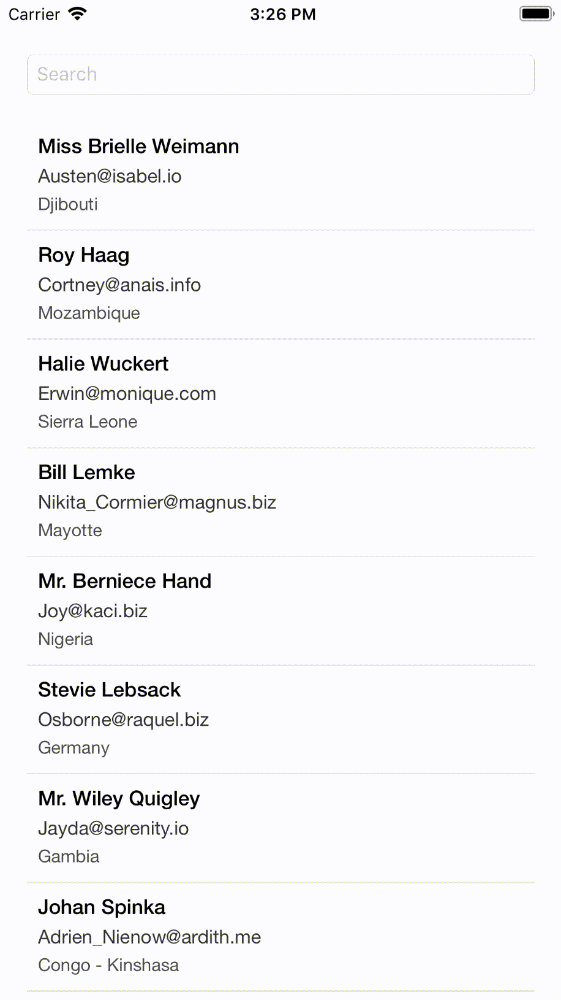

## iOS Filter Operation Manager (Swift)

In our projects sometimes we work with huge amount of data. To provide easy accessing to item we want to find, we are adding Search function to page. 

In this project default *filter()* function of sdk is used on the basis of filtering data. 

But it is possible to do some additional operations to reduce cost and make this filtering more effective.

To provide easy integration for efficiend filter operation, i created **FilterOperationManager** class that also contains some optimizations.  

### Integration Steps

Create an isntance of FilterOperationManager class that takes array of any Searchable model list. 

```
let filterManager = FilterOperationManager(allItems: dataList)
```

And implement the search completed handler.

```
filterManager.searchCompleted = { [weak self] filteredList in
  // reload page with filtered list.
}
```

And now, on every search step, call *filter()* function in filterManager.

```
filterManager.filter(searchText)
```

When filter operation is completed, the manager calls the completion handler that we implemented before.

In this project, sample list of 2000 user data (Generated from [here](http://www.databasetestdata.com/generated-data)) is used. 


FilterOperation's **filter()** function is called on each hit on keyboard. 

```
func textField(_ textField: UITextField, shouldChangeCharactersIn range: NSRange, replacementString string: String) -> Bool {
  ...
  
  filterManager.filter(searchText)
}

```

I will also write more detail about this manager soon.


